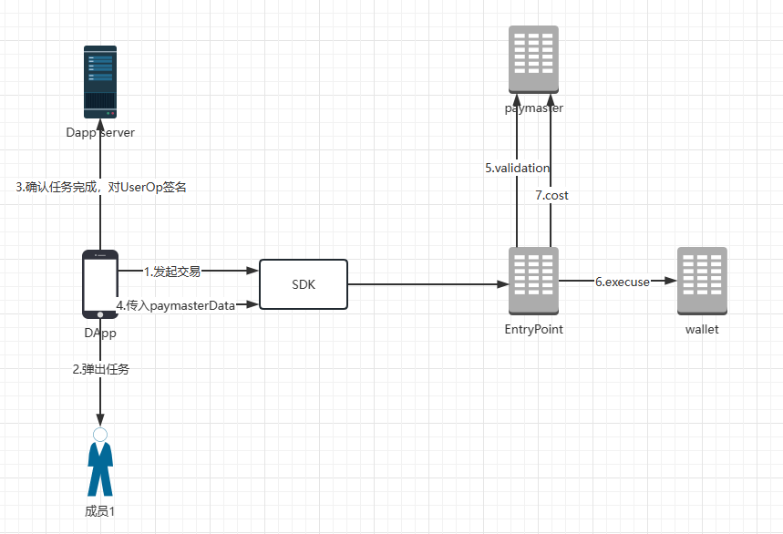

# longship-dapp-demo

## 启动

```
  npm install
  npm run dev
```

## web3-onboard 使用示例
```
import longshipModule from '@traitsniper/web3-onboard';
import { init } from "@web3-onboard/react";

const longship = longshipModule({
    appKey: '2462e054-4233-4ca1-bd79-be9512fc27b9', // 必填，用于区分不同dapp
    env: 'test', // 必填 test|prod
    chainType: 'testnet', // 必填，env为test支持bsc、testnet, env为prod支持bsc
    connectType: 'twitter', // 选填， 用于连接时直接通过Twitter登陆
    // 选填，用于信息展示
    appSetting: {
      appName: 'traitsniper',
      appIcon: 'https://wallet-demo.blockservice.io/static/img/coins/128x128/ETH.png'
    }
});

init({
    wallets: [longship],
    chains: [
      {
        id: '0x2537', // 9527
      }
    ],
    appMetadata: {
      name: 'Web3-Onboard Demo',
      icon: '<svg>App Icon</svg>',
      description: 'A demo of Web3-Onboard.'
    }
});

```

## web3-react-v6 使用示例
### 初始化
```
import { LongShipConnector } from "@traitsniper/web3-react-v6-connector";

const longshipConnector = new LongShipConnector({
    appKey: '2462e054-4233-4ca1-bd79-be9512fc27b9', // 必填，用于区分不同dapp
    env: 'test', // 必填 test|prod
    chainType: 'testnet', // 必填，test env支持bsc、testnet, prod env支持bsc
    connectType: 'twitter', // 选填， 用于连接时直接通过Twitter登陆
    // 选填，用于信息展示
    appSetting: {
        appName: 'traitsniper',
        appIcon: 'https://wallet-demo.blockservice.io/static/img/coins/128x128/ETH.png'
    }
});

const { activate } = useWeb3React();

activate(longshipConnector)

```

## SDK 使用示例

### 初始化
```
const longshipWallet = new LongshipSDK();
```

### 连接钱包
```
const account = await longshipWallet.login();
const { email, wallet_address } = account;
console.log('account', email, wallet_address);
```

### SignMessage和验签

#### 签名
```
try {
  const message = 'hello world';
  const sig = await longshipWallet.signMessage(message);
  console.log('sig', sig);
} catch (e) {
  console.log('sign error', e);
}
```
#### 验签
```
const result = await longshipWallet.isValidSignature(message, sig);
if (result) {
  console.log('verify signature success');
} else {
  console.log('verify signature failed');
}
```

## Paymaster


### 使用paymaster
```
try {
  await longshipWallet.sendTransaction({
    from: account.wallet_address,
    to: '0x1111',
    value: '1',
    data: '0x',
    paymasterOptions: {
      mode: 1, // 1: sponseored by able wallet
      extraData: JSON.stringify({ uid: '123' })
    },
  });
} catch(e) {
  console.log(e);
}
```
