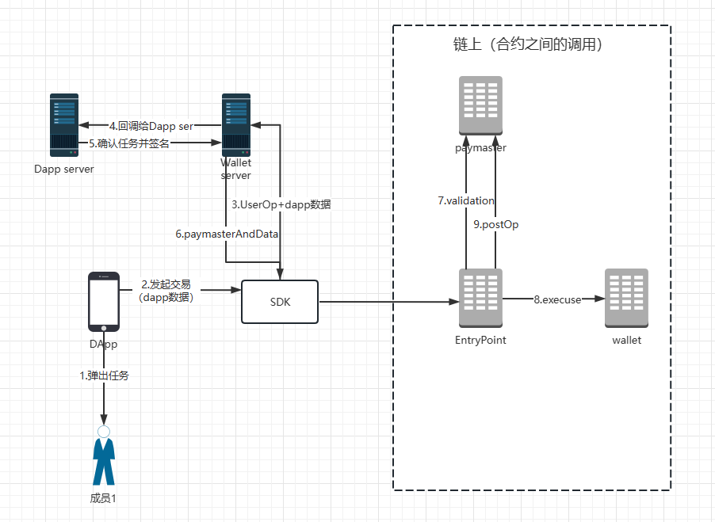

# longship-dapp-demo

## 启动

```
  npm install
  npm run dev
```

## SDK 使用示例

### 初始化
```
const longshipWallet = new LongshipSDK();
```

### 连接钱包
```
const account = await longshipWallet.login();
const { email, wallet_address } = account;
console.log('account', email, wallet_address);
```

### SignMessage和验签

#### 签名
```
try {
  const message = 'hello world';
  const sig = await longshipWallet.signMessage(message);
  console.log('sig', sig);
} catch (e) {
  console.log('sign error', e);
}
```
#### 验签
```
const result = await longshipWallet.isValidSignature(message, sig);
if (result) {
  console.log('verify signature success');
} else {
  console.log('verify signature failed');
}
```

## Paymaster


### 使用paymaster
```
try {
  await longshipWallet.sendTransaction({
    from: account.wallet_address,
    to: '0x1111',
    value: '1',
    data: '0x',
    paymasterOptions: {
      mode: 1, // 1: sponseored by able wallet
      extraData: JSON.stringify({ uid: '123' })
    },
  });
} catch(e) {
  console.log(e);
}
```
